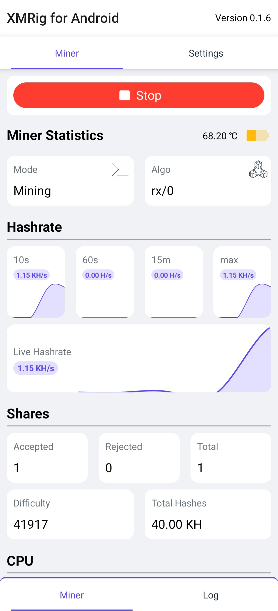
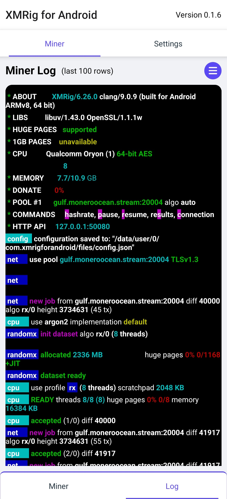
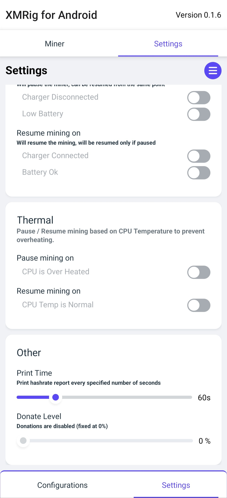

# XMRig for Android

  

  <strong>An Android front end for XMRig.</strong> 

  <a href="https://github.com/LWZsama/xmrig-for-android/releases/latest">Download the latest release</a>
  ·
  <a href="https://github.com/LWZsama/xmrig-for-android/issues">Report an issue</a>

  
  
  

> [!NOTE]
> This repository is an independently maintained continuation of
> [XMRig-for-Android/xmrig-for-android](https://github.com/XMRig-for-Android/xmrig-for-android).
> The original project has not been actively maintained for a long time, and its bundled
> XMRig and MoneroOcean XMRig binaries are outdated. This continuation keeps the Android
> application useful by tracking current upstream engine releases and maintaining the
> native build pipeline.

## Overview

XMRig for Android wraps the [XMRig](https://github.com/xmrig/xmrig) command-line miner in
an Android UI and foreground service. It makes pool and CPU configuration approachable for
new users while still offering an advanced configuration mode for experienced miners.

The app supports both the official XMRig engine and the
[MoneroOcean XMRig fork](https://github.com/MoneroOcean/xmrig). For miner configuration concepts
and command-line behavior, see the [XMRig documentation](https://xmrig.com/docs/miner).

## Performance improvements

This continuation also improves the performance of the original Android interface and its
mining integration:

- **Hardware-accelerated UI rendering.** Android hardware acceleration is enabled so
  dashboard cards, charts, scrolling, and transitions can be rendered more smoothly.
- **Bounded hashrate chart history.** The live chart renders only the latest 12 samples,
  preventing an ever-growing data set from increasing chart layout and rendering cost.
- **Lower background polling overhead.** Miner summary updates run every 15 seconds
  instead of 10 seconds, while thermal checks run every 20 seconds instead of 15 seconds.
  This reduces JSON-RPC, worker, and React Native update activity without making the
  dashboard feel unresponsive.
- **Adaptive CPU topology detection on ARM.** Before starting a Simple Mode profile, the
  app reads per-core maximum frequencies, detects big.LITTLE-style performance cores, and
  passes an appropriate thread count and CPU affinity to RandomX when the device exposes
  that information. Devices without usable topology data fall back to XMRig's normal CPU
  detection.
- **Tuned mining defaults.** Simple Mode now defaults to RandomX auto mode, CPU priority
  2, scheduler yielding disabled for maximum hashrate, and a 100% thread hint. Existing
  Simple Mode profiles are also normalized to the optimized RandomX, priority, and yield
  defaults; the controls remain user-configurable.
- **Smarter ARM thread scaling.** The bundled XMRig patches make the ARM backend honor
  <code>max-threads-hint</code> when calculating the actual thread count, instead of
  always using every detected CPU thread.
- **Reduced log overhead.** Native miner verbosity defaults to 0, reducing unnecessary
  log output and processing while mining.
- **Release-optimized native binaries.** XMRig and MoneroOcean XMRig are compiled with
  CMake's Release build type for the packaged Android libraries.

## Engines

The current pins in this checkout are:

| Engine | Upstream tag |
| --- | --- |
| Official XMRig | <code>v6.26.0</code> |
| MoneroOcean XMRig | <code>v6.26.0-mo4</code> |

The version pins live in
[xmrig/lib-builder/script/xmrig-fetch.sh](xmrig/lib-builder/script/xmrig-fetch.sh) and
[xmrig/lib-builder/script/xmrig-mo-fetch.sh](xmrig/lib-builder/script/xmrig-mo-fetch.sh).
These files are the source of truth when the native engines are updated.

The [daily release watcher](.github/workflows/watch-xmrig-release.yml) compares the
repository pins with upstream tags. When a newer release is detected, it dispatches the
[build and release workflow](.github/workflows/build-and-release.yml), which rebuilds the
native engines and publishes the Android artifacts.

## Screenshots

  
  
  

  <em>Dashboard · Log · Settings</em>

## Installation

1. Download the universal APK from the
   [latest GitHub Release](https://github.com/LWZsama/xmrig-for-android/releases/latest).
2. Open the app, create a configuration, enter your pool and wallet details, then start
   the miner.

## Build from source

See [BUILD.md](BUILD.md) for the complete build and release-signing instructions.
The main requirements are:

- JDK 17
- Node.js 20 and Yarn
- Python 3 with <code>setuptools</code>
- Android SDK Platform and Build Tools 34
- Android NDK <code>r21e</code> (<code>21.4.7075529</code>)
- CMake, GNU Make, and the React Native Android toolchain

A debug build can be started with:

~~~bash
git clone https://github.com/LWZsama/xmrig-for-android.git
cd xmrig-for-android

yarn install --frozen-lockfile

# Build libuv, OpenSSL, XMRig, and MoneroOcean XMRig.
cd xmrig/lib-builder
make all
cd ../..

# Terminal 1: start Metro.
yarn start

# Terminal 2: install and launch the debug app.
npx react-native run-android
~~~

The native builder automatically looks for <code>r21e</code> under the Android SDK. If it
cannot find the NDK, set <code>ANDROID_NDK_HOME</code> or <code>ANDROID_NDK_ROOT</code>
before running <code>make all</code>. Release builds require a stable signing keystore;
the required variables are documented in [BUILD.md](BUILD.md).

## Safety

CPU mining applies sustained load to a mobile device. Use adequate cooling, monitor
temperature and battery health, and stop mining if the device becomes excessively hot or
unstable. The optional thermal and power controls can pause or resume mining automatically,
but they should not replace normal supervision.

## Donations

Donation Level is fixed at 0%.

## License and credits

This project is distributed under the [GNU General Public License v3.0](LICENSE).
The bundled native engines and their local build patches are covered by their respective
upstream licenses. See [THIRD_PARTY_NOTICES.md](THIRD_PARTY_NOTICES.md) before
redistributing an APK or other build artifacts.

The Android UI and integration are based on the original
[XMRig for Android project](https://github.com/XMRig-for-Android/xmrig-for-android).
The splash screen artwork is credited to [AOICARD](https://www.reddit.com/user/AOICARD/).
